# GitHub Copilot Instructions for 9898-MTG-Chaos-RPG-2026

## Purpose
This file provides guidance for GitHub Copilot and related AI agents on how to assist with this project. It defines coding standards, agent behaviors, and project-specific preferences.

---

## Coding Standards
- Use modern JavaScript (ES6+) and TypeScript where appropriate.
- Prefer modular code structure; use `src/` for main code, `scripts/` for automation, `docs/` for documentation, `src/docs/` for in-code documentation, `docs/reports/` for reports, `docs/wiki/` for wiki content, `src/lib/` for libraries and JSON data, `src/scenes/` for game scenes and HTML pages, `src/scripts/` for game logic, automated game scripts, HTML JavaScripts, and `src/styles/` for CSS, HTML styles.
- Follow best practices for HTML, CSS, and JS linting.
- Use descriptive variable and function names.
- Document complex functions with concise comments.

---

## Agent Behavior
- Always attempt to resolve user requests fully before yielding.
- When editing files, use the patch format and avoid unnecessary repetition.
- Proactively create `.env` files with placeholders if environment variables are required.
- Use the todo list for multi-step tasks and mark progress clearly.
- Prefer running tasks via VS Code tasks when available.

---

## Project Preferences
- Game logic and automation scripts are in `src/` and `scripts/`.
- Documentation is in `docs/` and `src/docs/`.
- Reports and analyses are in `docs/reports/`.
- Use `phaser/` for game plugins and extensions.
- Use `test.txt` and `src/scripts/*.test.js` for testing.

---

## Special Instructions
- When generating reports, use modern HTML/CSS/JS for clarity and style.
- For deep research or analysis, prefer automation scripts in `scripts/`.
- When scaffolding new features, follow the existing directory structure.

---

## Contact
For questions or clarifications, refer to `README.md` or project maintainers.

---

## Project Structure Overview

### Complete Directory Structure Flowchart

```mermaid
flowchart TD
	ROOT[Project Root]
	ROOT --> G1[.github/]
	ROOT --> G2[.vscode/]
	ROOT --> G3[docs/]
	ROOT --> G4[node_modules/]
	ROOT --> G5[package-lock.json]
	ROOT --> G6[package.json]
	ROOT --> G7[phaser/]
	ROOT --> G8[project.txt]
	ROOT --> G9[README.md]
	ROOT --> G10[scripts/]
	ROOT --> G11[src/]
	ROOT --> G12[test.txt]
	G3 --> D1[example.md]
	G3 --> D2[game-rules.html]
	G3 --> D3[game-rules.md]
	G3 --> D4[Perchance Plugins.md]
	G3 --> D5[perchance-code.html]
	G3 --> D6[perchance-code.md]
	G3 --> D7[reports/]
	G3 --> D8[wiki/]
	D7 --> DR1[analyze.report.html]
	D7 --> DR2[analyze.report.md]
	D7 --> DR3[deep-research.report.html]
	D7 --> DR4[deep-research.report.md]
	D7 --> DR5[report.html]
	D7 --> DR6[report.ultra-deep.html]
	D7 --> DR7[report.ultra-deep.md]
	D7 --> DR8[ultra-deep-analyses-report.html]
	D7 --> DR9[ultra-deep-analyses-report.md]
	D8 --> DW1[9898-MTG-Chaos-RPG-Wiki/]
	DW1 --> DW1A[index.md]
	DW1 --> DW1B[scryfall-api.md]
	G7 --> P1[dist/]
	G7 --> P2[plugins/]
	P2 --> PP1[camera3d/]
	P2 --> PP2[spine/]
	P2 --> PP3[spine4.1/]
	PP1 --> PPC1[dist/]
	PP2 --> PPS1[dist/]
	PP3 --> PPS2[dist/]
	G10 --> S1[run-analyze-project.bat]
	G10 --> S2[run-analyze-project.js]
	G10 --> S3[run-analyze-project.ps1]
	G10 --> S4[run-deep-research-iterate.bat]
	G10 --> S5[run-deep-research-iterate.js]
	G10 --> S6[run-deep-research-iterate.ps1]
	G10 --> S7[run-implement-integrate-improvements.bat]
	G10 --> S8[run-implement-integrate-improvements.js]
	G10 --> S9[run-implement-integrate-improvements.ps1]
	G10 --> S10[run-master-project-iteration.bat]
	G10 --> S11[run-master-project-iteration.js]
	G10 --> S12[run-master-project-iteration.ps1]
	G10 --> S13[run-report-project-tasks-iteration.bat]
	G10 --> S14[run-report-project-tasks-iteration.js]
	G10 --> S15[run-report-project-tasks-iteration.ps1]
	G10 --> S16[run-write-build-deploy-test-update.bat]
	G10 --> S17[run-write-build-deploy-test-update.js]
	G10 --> S18[run-write-build-deploy-test-update.ps1]
	G11 --> SD1[docs/]
	G11 --> SL1[lib/]
	G11 --> SS1[scenes/]
	G11 --> SS2[scripts/]
	G11 --> SS3[styles/]
	SD1 --> SD1A[This dir is for all game docs.txt]
	SL1 --> SL1A[boardgame.js]
	SL1 --> SL1B[data.json]
	SL1 --> SL1C[example.json]
	SL1 --> SL1D[tasks.json]
	SL1 --> SL1E[This dir is for all game JSON.txt]
	SL1 --> SL1F[utils.js]
	SS1 --> SS1A[9898-mtg-chaos-rpg-2026.html]
	SS1 --> SS1B[9898-MTG-Chaos-RPG-Commander-Booster-Pack-Generator.html]
	SS1 --> SS1C[example.html]
	SS1 --> SS1D[index.html]
	SS1 --> SS1E[scene-boardgameio-demo.html]
	SS1 --> SS1F[scene-game-rules.html]
	SS1 --> SS1G[scene-phaser-demo.html]
	SS1 --> SS1H[scene-scryfall-api.html]
	SS1 --> SS1I[scene-wiki.html]
	SS1 --> SS1J[This dir is for all game HTML.txt]
	SS2 --> SS2A[autofix-html.js]
	SS2 --> SS2B[boardgame.test.js]
	SS2 --> SS2C[example.js]
	SS2 --> SS2D[example.ts]
	SS2 --> SS2E[game.js]
	SS2 --> SS2F[game.test.js]
	SS2 --> SS2G[lint-html-css-js-json.test.js]
	SS2 --> SS2H[report-htmlhint-issues.js]
	SS2 --> SS2I[test-scripts.test.js]
	SS2 --> SS2J[This dir is for all game JavaScript.txt]
	SS2 --> SS2K[validate-configs.test.js]
	SS3 --> SS3A[example.css]
	SS3 --> SS3B[style.css]
	SS3 --> SS3C[This dir is for all game CSS.txt]
```

### All Files and Folders Table

| Path / File | Type | Description |
|-------------|------|-------------|
| `.github/` | Directory | GitHub workflows, issue templates, and automation configs |
| `.vscode/` | Directory | VS Code workspace settings and launch configs |
| `copilot-instructions.md` | File | Copilot and agent instructions (this file) |
| `docs/` | Directory | Project documentation, rules, reports, and wiki |
| `docs/example.md` | File | Example documentation |
| `docs/game-rules.html` | File | Game rules in HTML format |
| `docs/game-rules.md` | File | Game rules in Markdown format |
| `docs/Perchance Plugins.md` | File | Perchance plugin documentation |
| `docs/perchance-code.html` | File | Perchance code in HTML |
| `docs/perchance-code.md` | File | Perchance code in Markdown |
| `docs/reports/` | Directory | Project reports and analyses |
| `docs/reports/analyze.report.html` | File | Analyze report (HTML) |
| `docs/reports/analyze.report.md` | File | Analyze report (Markdown) |
| `docs/reports/deep-research.report.html` | File | Deep research report (HTML) |
| `docs/reports/deep-research.report.md` | File | Deep research report (Markdown) |
| `docs/reports/report.html` | File | Main project report (HTML) |
| `docs/reports/report.ultra-deep.html` | File | Ultra-deep report (HTML) |
| `docs/reports/report.ultra-deep.md` | File | Ultra-deep report (Markdown) |
| `docs/reports/ultra-deep-analyses-report.html` | File | Ultra-deep analyses report (HTML) |
| `docs/reports/ultra-deep-analyses-report.md` | File | Ultra-deep analyses report (Markdown) |
| `docs/wiki/` | Directory | Wiki content and guides |
| `docs/wiki/9898-MTG-Chaos-RPG-Wiki/` | Directory | Main wiki folder |
| `docs/wiki/9898-MTG-Chaos-RPG-Wiki/index.md` | File | Wiki index |
| `docs/wiki/9898-MTG-Chaos-RPG-Wiki/scryfall-api.md` | File | Scryfall API documentation |
| `node_modules/` | Directory | Node.js dependencies (auto-managed) |
| `package-lock.json` | File | Node.js lockfile (auto-managed) |
| `package.json` | File | Node.js project configuration and dependencies |
| `phaser/` | Directory | Game plugins and extensions |
| `phaser/dist/` | Directory | Phaser build output (if present) |
| `phaser/plugins/` | Directory | Phaser plugins |
| `phaser/plugins/camera3d/` | Directory | Camera3D plugin |
| `phaser/plugins/camera3d/dist/` | Directory | Camera3D build output (if present) |
| `phaser/plugins/spine/` | Directory | Spine plugin |
| `phaser/plugins/spine/dist/` | Directory | Spine build output (if present) |
| `phaser/plugins/spine4.1/` | Directory | Spine 4.1 plugin |
| `phaser/plugins/spine4.1/dist/` | Directory | Spine 4.1 build output (if present) |
| `project.txt` | File | Project notes or metadata |
| `README.md` | File | Project overview and instructions |
| `scripts/` | Directory | Automation scripts for project analysis, reporting, and iteration |
| `scripts/run-analyze-project.bat` | File | Batch script for analysis |
| `scripts/run-analyze-project.js` | File | JS script for analysis |
| `scripts/run-analyze-project.ps1` | File | PowerShell script for analysis |
| `scripts/run-deep-research-iterate.bat` | File | Batch script for deep research |
| `scripts/run-deep-research-iterate.js` | File | JS script for deep research |
| `scripts/run-deep-research-iterate.ps1` | File | PowerShell script for deep research |
| `scripts/run-implement-integrate-improvements.bat` | File | Batch script for improvements |
| `scripts/run-implement-integrate-improvements.js` | File | JS script for improvements |
| `scripts/run-implement-integrate-improvements.ps1` | File | PowerShell script for improvements |
| `scripts/run-master-project-iteration.bat` | File | Batch script for master iteration |
| `scripts/run-master-project-iteration.js` | File | JS script for master iteration |
| `scripts/run-master-project-iteration.ps1` | File | PowerShell script for master iteration |
| `scripts/run-report-project-tasks-iteration.bat` | File | Batch script for reporting |
| `scripts/run-report-project-tasks-iteration.js` | File | JS script for reporting |
| `scripts/run-report-project-tasks-iteration.ps1` | File | PowerShell script for reporting |
| `scripts/run-write-build-deploy-test-update.bat` | File | Batch script for build/deploy/test/update |
| `scripts/run-write-build-deploy-test-update.js` | File | JS script for build/deploy/test/update |
| `scripts/run-write-build-deploy-test-update.ps1` | File | PowerShell script for build/deploy/test/update |
| `src/` | Directory | Main source code for the game and supporting files |
| `src/docs/` | Directory | Placeholder for in-code documentation |
| `src/docs/This dir is for all game docs.txt` | File | Placeholder note |
| `src/lib/` | Directory | Game libraries, data, and utility scripts |
| `src/lib/boardgame.js` | File | Board game logic |
| `src/lib/data.json` | File | Game data (JSON) |
| `src/lib/example.json` | File | Example data (JSON) |
| `src/lib/tasks.json` | File | Task data (JSON) |
| `src/lib/This dir is for all game JSON.txt` | File | Placeholder note |
| `src/lib/utils.js` | File | Utility functions |
| `src/scenes/` | Directory | Game scenes, HTML pages, and UI demos |
| `src/scenes/9898-mtg-chaos-rpg-2026.html` | File | Main game HTML |
| `src/scenes/9898-MTG-Chaos-RPG-Commander-Booster-Pack-Generator.html` | File | Booster pack generator HTML |
| `src/scenes/example.html` | File | Example scene HTML |
| `src/scenes/index.html` | File | Main index HTML |
| `src/scenes/scene-boardgameio-demo.html` | File | Boardgame.io demo HTML |
| `src/scenes/scene-game-rules.html` | File | Game rules scene HTML |
| `src/scenes/scene-phaser-demo.html` | File | Phaser demo scene HTML |
| `src/scenes/scene-scryfall-api.html` | File | Scryfall API scene HTML |
| `src/scenes/scene-wiki.html` | File | Wiki scene HTML |
| `src/scenes/This dir is for all game HTML.txt` | File | Placeholder note |
| `src/scripts/` | Directory | Game logic, test scripts, and automation for gameplay |
| `src/scripts/autofix-html.js` | File | HTML auto-fix script |
| `src/scripts/boardgame.test.js` | File | Board game tests |
| `src/scripts/example.js` | File | Example script |
| `src/scripts/example.ts` | File | Example TypeScript script |
| `src/scripts/game.js` | File | Main game logic |
| `src/scripts/game.test.js` | File | Game logic tests |
| `src/scripts/lint-html-css-js-json.test.js` | File | Linting tests |
| `src/scripts/report-htmlhint-issues.js` | File | HTMLHint report script |
| `src/scripts/test-scripts.test.js` | File | Test scripts |
| `src/scripts/This dir is for all game JavaScript.txt` | File | Placeholder note |
| `src/scripts/validate-configs.test.js` | File | Config validation tests |
| `src/styles/` | Directory | CSS and style files for the game UI |
| `src/styles/example.css` | File | Example CSS |
| `src/styles/style.css` | File | Main style CSS |
| `src/styles/This dir is for all game CSS.txt` | File | Placeholder note |
| `test.txt` | File | General test file for quick checks |

### Directory Purpose and Flow

- **.github/**: GitHub-specific configuration, workflows, and automation.
- **.vscode/**: VS Code workspace settings and launch configurations.
- **docs/**: Documentation, rules, reports, and wiki content. Use for reference, onboarding, and project history.
- **phaser/**: Plugins and extensions for the Phaser game engine. Extend or customize game features here.
- **scripts/**: Automation scripts for project management, analysis, and reporting. Run these to automate repetitive or complex tasks.
- **src/**: Main game source code. Subdirectories:
	- **docs/**: Placeholder for in-code documentation.
	- **lib/**: Core libraries, data files, and utilities.
	- **scenes/**: HTML and UI for different game scenes and demos.
	- **scripts/**: Game logic, test automation, and gameplay scripts.
	- **styles/**: CSS and style assets for the game UI.
- **node_modules/**: Node.js dependencies (auto-managed).
- **package.json / package-lock.json**: Node.js project configuration and lockfile.
- **README.md**: Project overview and instructions.
- **test.txt / project.txt**: General test file and project notes.

---

_Last updated: March 18, 2026_